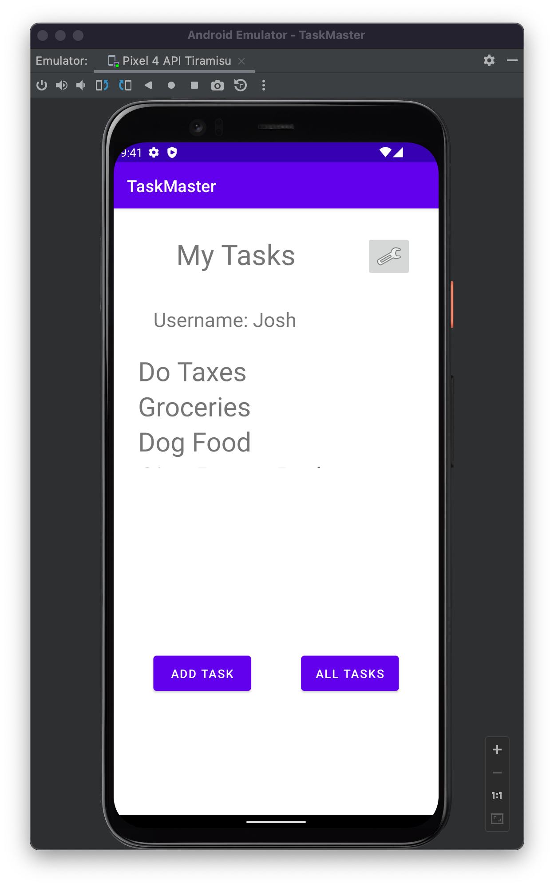
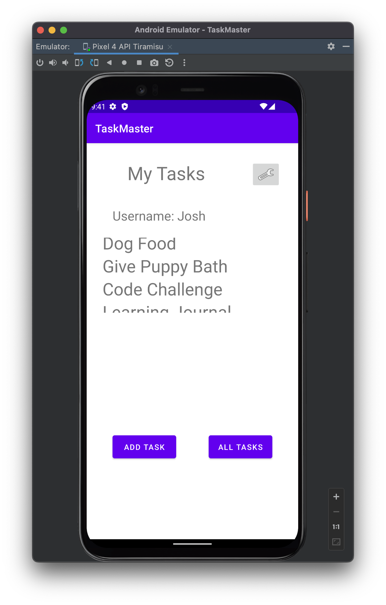
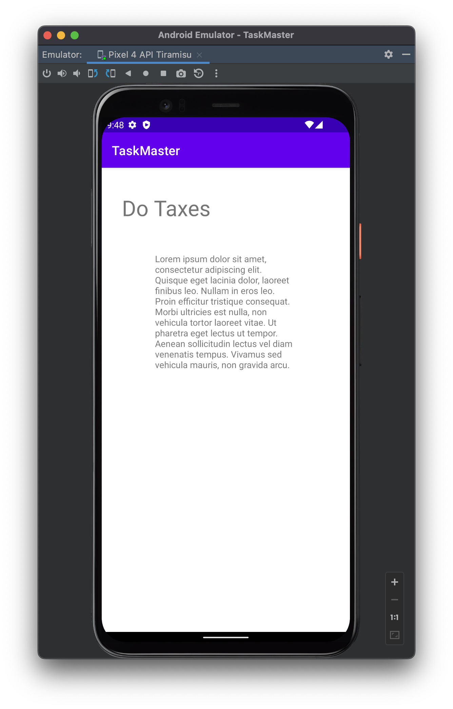
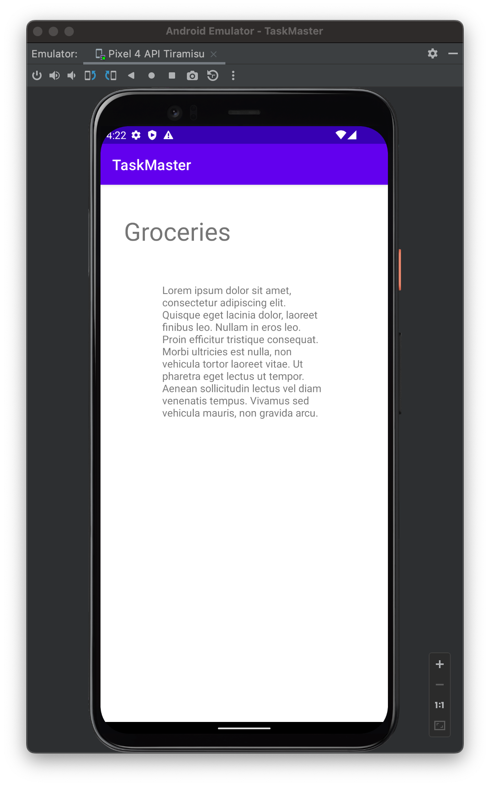
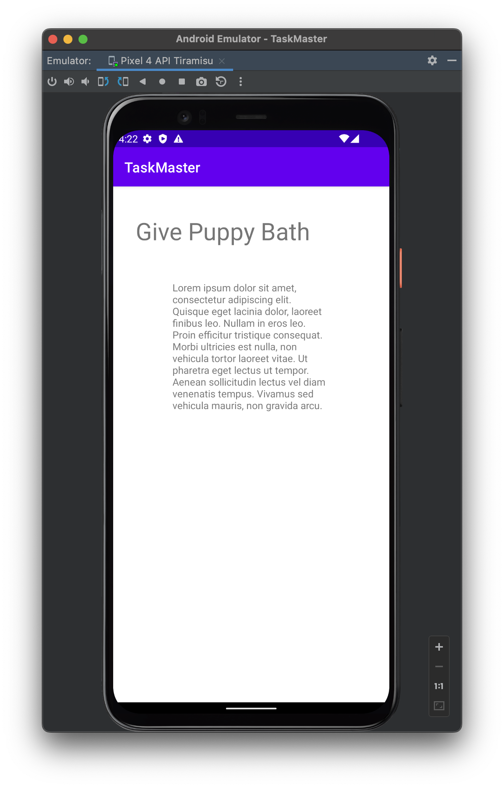
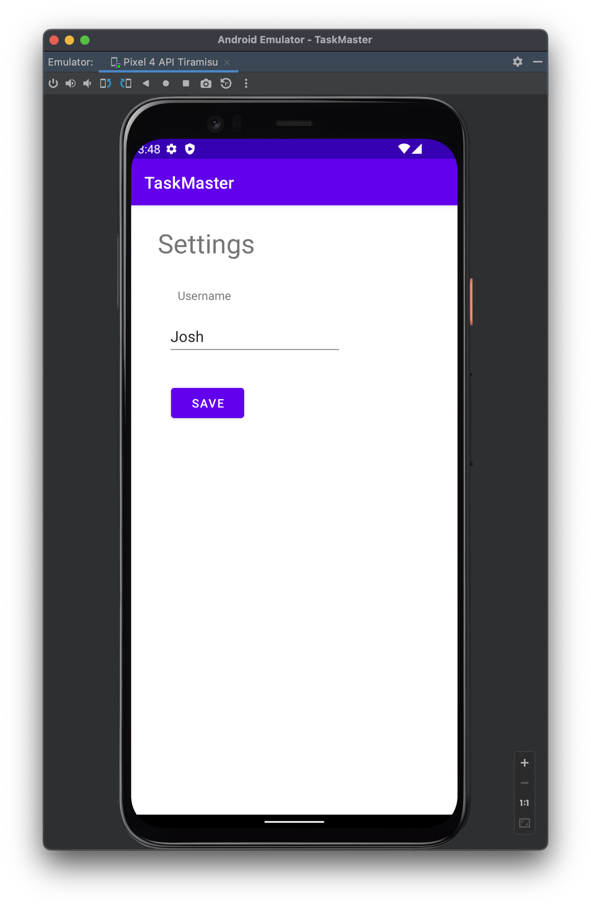
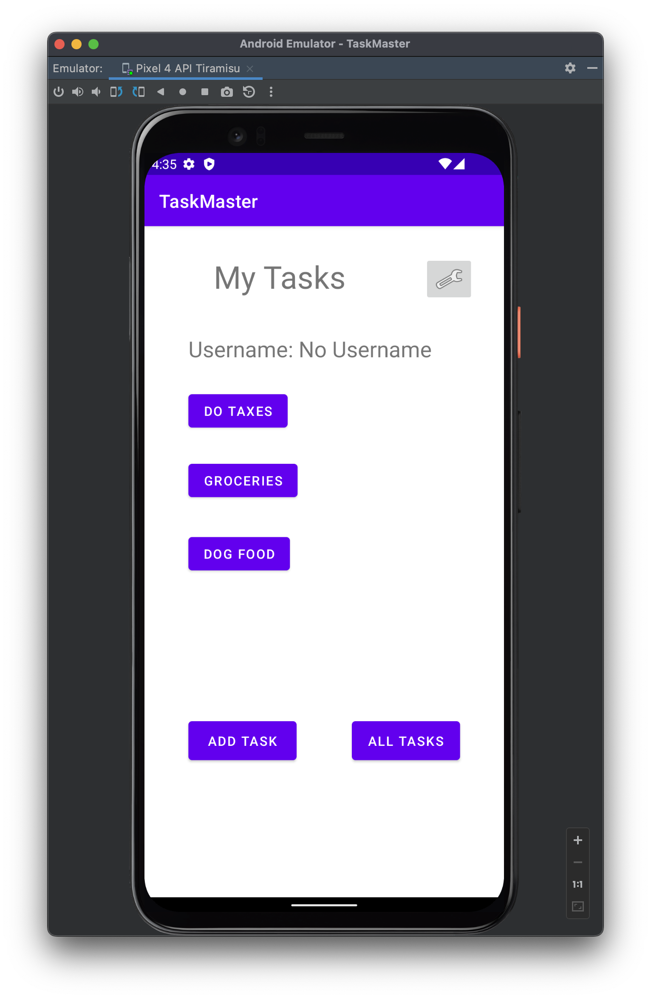
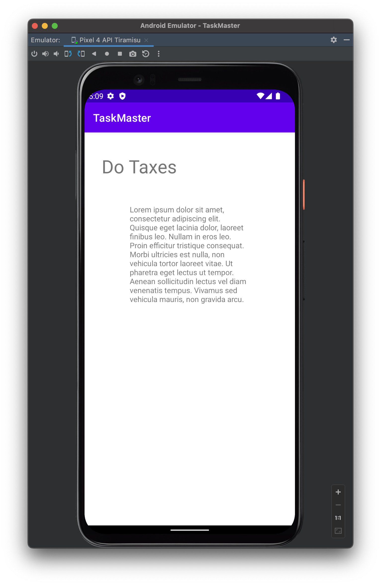
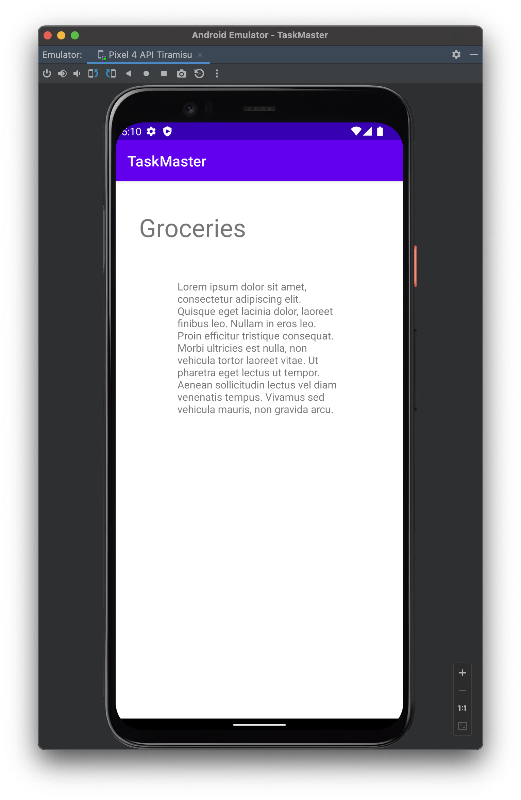
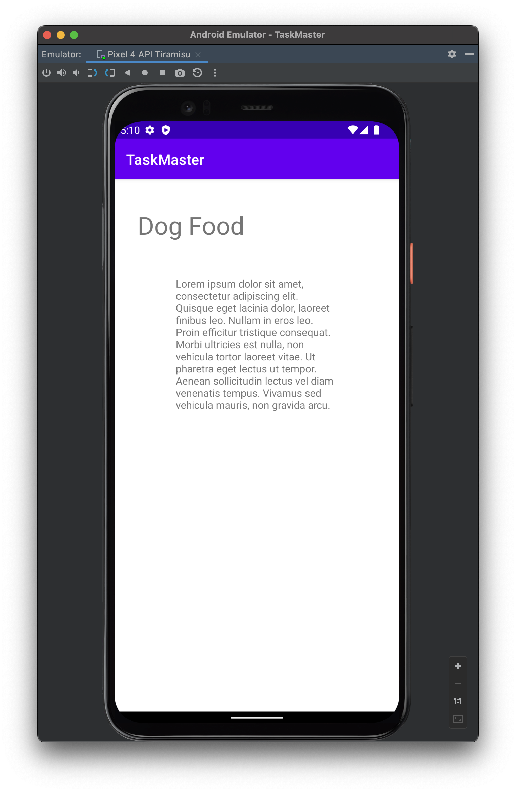

# Task Master
Andorid task management application. Manage all your tasks from one app.

## Implementation
- You can run in app from app/
- If needed app-debug.apk file in root taskmaster/
- [app-debug.apk](app-debug.apk)

# Daily Log 03.24.2022

### Overview

Adding RecyclerViews in order to display a list of data on the homepage.

### Updates
- Set up a Room and save Task in Lcoal Database
  
  
- Update My Tasks page to display from local database your task in recyclerView
  
  
- When Task is tapped, the Deatils page appears and the Title is set and description
  

### Features
- Add Task Model Class: As a user I want to create a task and save it top the  local database
- Add RecycleViewer to Display List of Tasks: As a user I want to see my list of task on the My Tasks Page in local database
- Add Tap Task Item: As a user I want to be able to tap my tasks on the homepage to see specific task details like title and description.

### Tests
- Espresso test goPagesTest Test all "goToPages" intents on buttons and recycler view taps

### Work Time
-TBD

# Daily Log 03.23.2022

## Refactor 03.24.2022 Fixed Bug updating Task Detail Title from RecyclerView items

### Overview

Adding RecyclerViews in order to display a list of data on the homepage.

### Updates
- Add recycler views to My Tasks page
  
  
  
- Add tap feature to list item to take you to task deatils page
  
  
  
### Features
- Add Task Model Class: As a user I want to create a taks with a title, body, and state: “new”, “assigned”, “in progress”, or “complete”.
- Add RecycleViewer to Display List of Tasks: As a user I want to see my list of task on the My Tasks Page.
- Add Tap Task Item: As a user I want to be able to tap my tasks on the homepage to see specific task details. 

### Tests
- Espresso test goPagesTest Test all "goToPages" intents on buttons and recycler view taps

### Work Time
- 6 Hours
- 30 minutes Fixed Bug; Updated README with more screenshots; Built new APK

# Daily Log 03.22.2022

### Overview

Adding the SharedPreferences and intents for data to be added to our Task Master app.

### Updates
- Settings built
  
- My Tasks with username and task buttons built
  
  
- Task Details built
  
  
  

### Features
- Add Task Detail Page: As a user I want to be able to see details of individual tasks on the homepage with a buttons or link to see deatils
- Add Setting Page: As a user I want to be able have a settings page where I update my username.
- Add Task Title Button: As a user I want to be able to click my tasks on the homepage to see specific task details. The
Title should upodate on the task detail page.
  
### Tests
- [AllButtonTasksTaskDetailsMyTasksActivityTest](app/src/androidTest/java/com/joshuamccluskey/taskmaster/AllButtonTasksTaskDetailsMyTasksActivityTest.java)
- [DoTaxesTest](app/src/androidTest/java/com/joshuamccluskey/taskmaster/DoTaxesTest.java)

### Work Time

- 3.5 Hours

# Daily Log 03.21.2022

### Overview

Wireframe build of the TaskMaster Android app. My Tasks page, Add Tasks page, All Tasks page built
  
### Updates

#### My Tasks page built
 
#### Add Task page built

#### All Tasks page built

### Features
- Add a homepage: As a user I want to be able to see my tasks on the homepage with buttons to add and see all tasks
- Add a task: As a user I want to be able to add a task and see its been submitted.
- Add Task Title and Description: As a user I want to be able to add the task title and description.
- Taks page only contains an image no function
  
### Work Time

- 5 hours
- 2 hours Debugging and adding visibility of submitted message onClick Add Task Button
