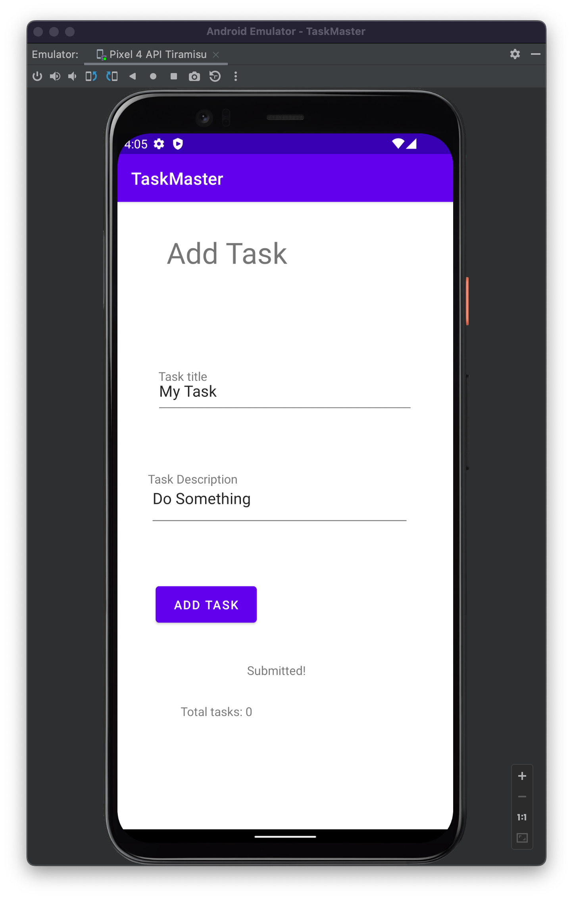

# Task Master
Andorid task management application. Manage all your tasks from one app.

## Implementation
- You can run in app from app/
- If needed app-debug.apk file in root taskmaster/
- [app-debug.apk](app-debug.apk)

# Daily Log 03.22.2022

### Overview

Adding the SharedPreferences and intents for data to be added to our Task Master app.

### Updates

- My Tasks page built
  
- Add Task page built
  
- All Tasks page built
  

### Features
- Add Task Detail Page: As a user I want to be able to see details of individual tasks on the homepage with a buttons or link to see deatils
- Add Setting Page: As a user I want to be able have a settings page where I update my username.
- Add Task Title Button: As a user I want to be able to click my tasks on the homepage to see specific task details. The
Title should upodate on the task detail page.
  

### Work Time

- TBD

# Daily Log 03.21.2022

### Overview

Wireframe build of the TaskMaster Android app. My Tasks page, Add Tasks page, All Tasks page built
  
### Updates

#### My Tasks page built
 
#### Add Task page built

#### All Tasks page built

### Features
- Add a homepage: As a user I want to be able to see my tasks on the homepage with buttons to add and see all tasks
- Add a task: As a user I want to be able to add a task and see its been submitted.
- Add Task Title and Description: As a user I want to be able to add the task title and description.
- Taks page only contains an image no function
  
### Work Time

- 5 hours
- 2 hours Debugging and adding visibility of submitted message onClick Add Task Button
